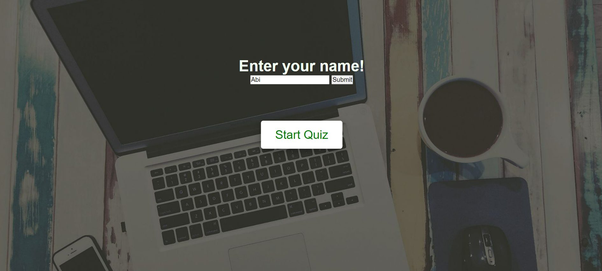
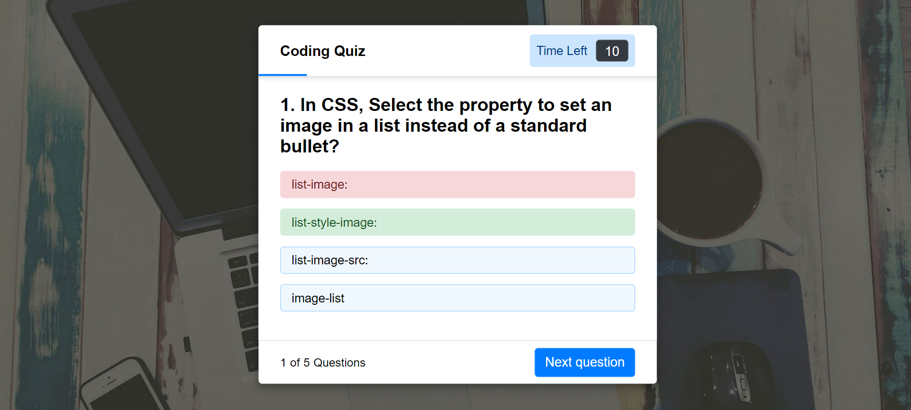
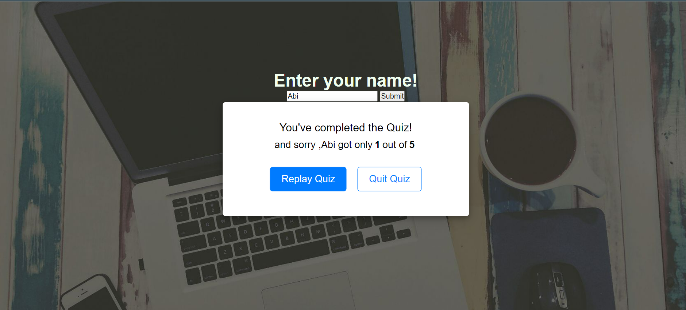

# CodeQuiz
## Mockup
The following image shows the web application's appearance and functionality:

When you load the app, you are asked to enter your name and the press start quiz button.
The quiz have 5 multiple choice question with each question have 10 seconds of time to answer.
When you click an answer, the right answer will turn green and if the option you clicked is wrong, it will turn red
When you enter a wrong answer the timer stops and you will get only 10 seconds for the next question.
When the timer runs out you are asked to go to next question by clicking next question button.
Next qusetion button helps you to go to next question.
At the end after finishing 5 questions you will be displayed the result with your name and asks you whether to replay or quit the quiz.

